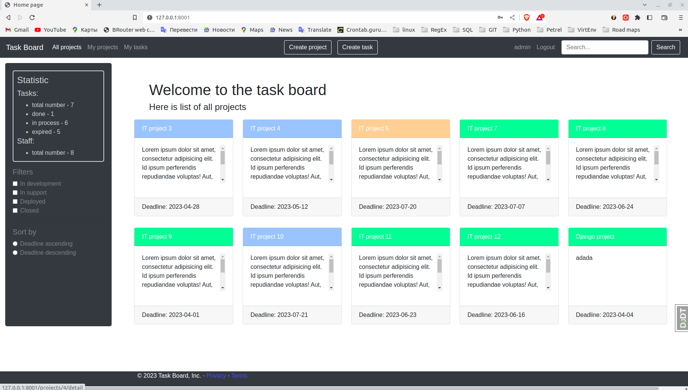
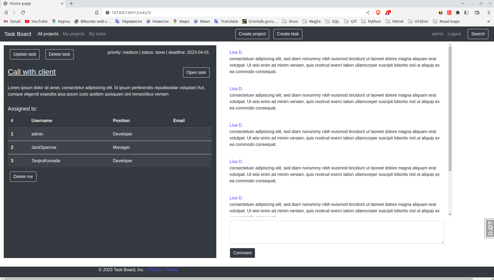

# Task-manager Project

Django pet-project. It helps to manage tasks for certain project.
Abilities:
1. Creating, updating and deleting project
2. Adding task, updating and deleting to project
3. Assigning worker to project
4. Simple filtering by name


## Check it out!

[Task Board Service deployed to Render](https://task-board-service.onrender.com/)

Test User:
- login: TestUser
- password: saha5991


## Installation

Python3 must be already installed

```shell
git clone https://github.com/ZhAlexR/task_board
cd task-manager
python -m venv venv
source venv/bin/activate (on macOS and linux-systems)
venv\Scripts\activate (on Windows)
pip install -r requirements.txt
python manage.py makemigration
python manage.py migrate 
python manage.py runserver # starts Django server
```

## Features

* Creating projects
* Managing projects tasks
* Checkout projects and task details

## Demo


!

